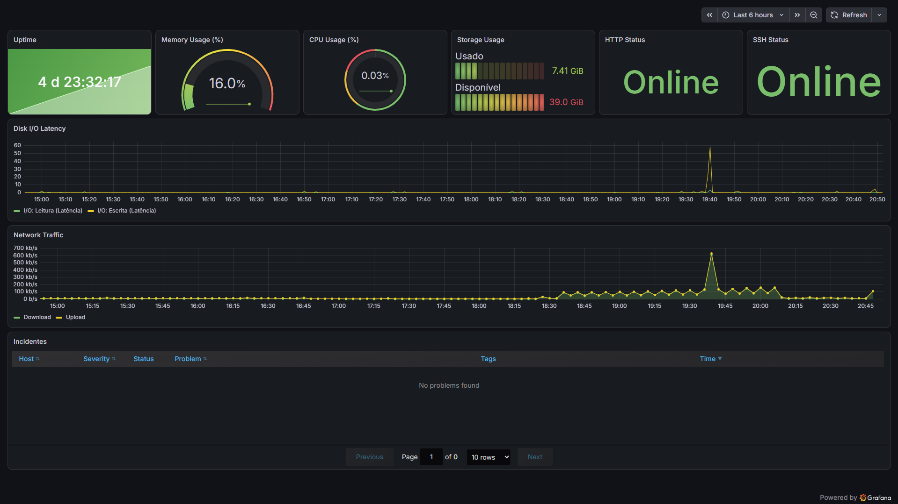
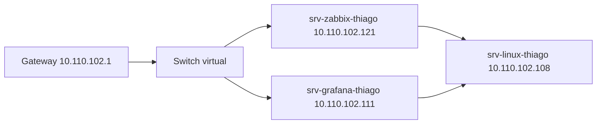
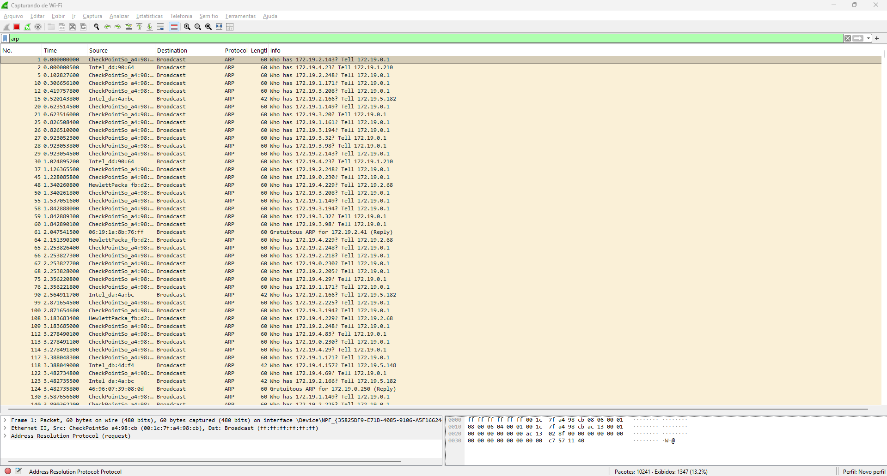
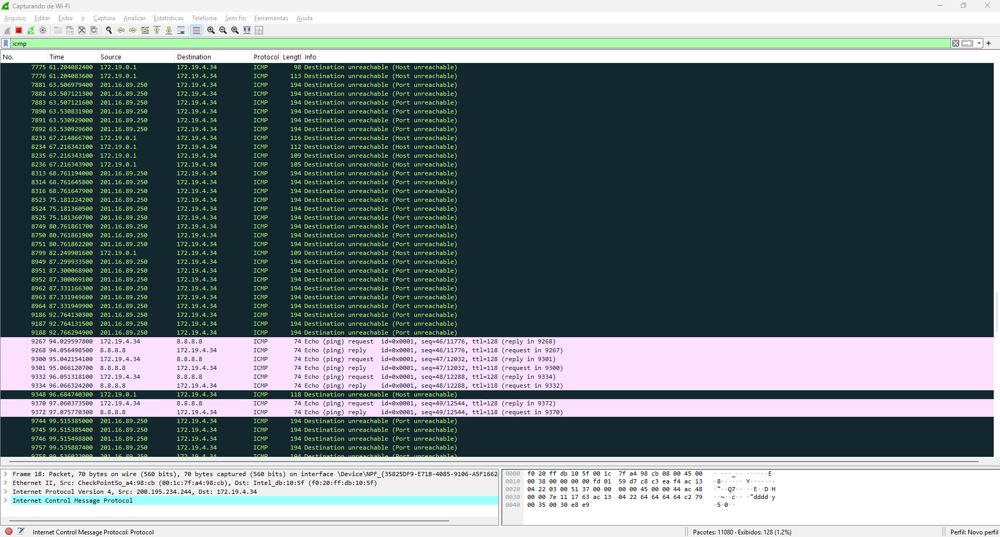
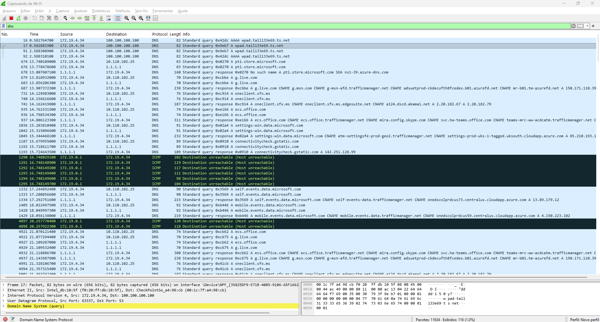
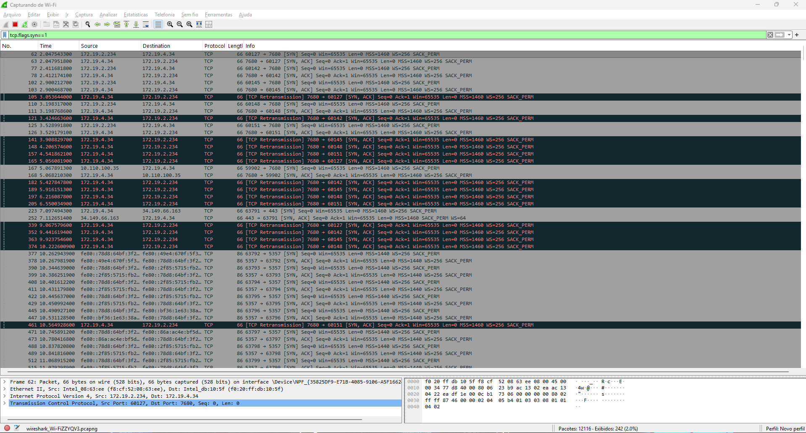
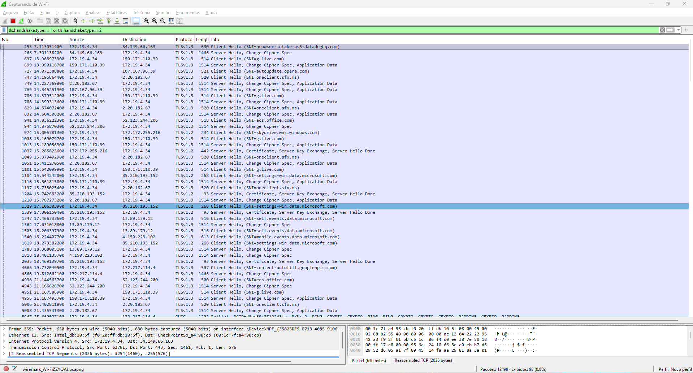
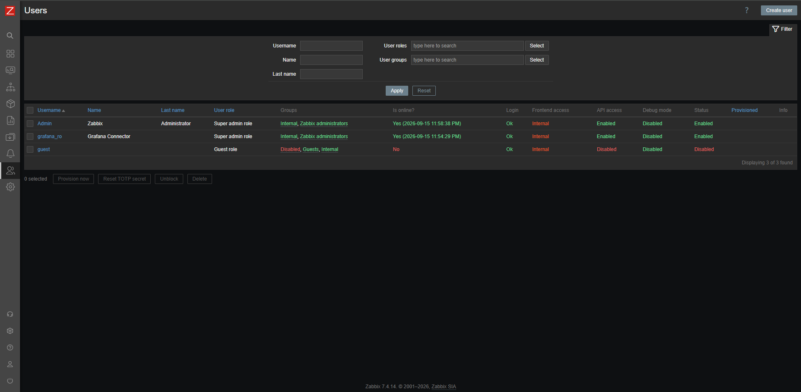

# Projeto Operação NOC — Thiago Bovo Costa



> **Investigação, Monitoramento e Observabilidade de Redes**
> Ubuntu Server + Redes + Wireshark + Zabbix + Grafana

## Identificação

| Campo | Valor |
|---|---|
| Aluno(a) / Grupo | Thiago Bovo Costa |
| Turma | Defesa Cibernética — 2026 |
| Professor | Frank Philson |
| Data | 14–15/09/2026 |
| Rede do laboratório (Rede LAN) | `10.110.102.0/24` |

## Objetivo

Implementar e documentar um laboratório de **Network Operations Center (NOC)** capaz de monitorar disponibilidade, serviços e recursos, combinando diagnóstico de rede, análise de pacotes, monitoramento com Zabbix e visualização no Grafana.

> **Regra operacional utilizada:** primeiro observar e coletar evidências; depois formular a hipótese, corrigir, validar e documentar.

## Ambiente de referência

| Hostname | IP | Função | Stack real |
|---|---:|---|---|
| `srv-zabbix-thiago` | `10.110.102.121` | Zabbix Server + Frontend | Zabbix 7.4 + **PostgreSQL** + **Nginx** |
| `srv-grafana-thiago` | `10.110.102.111` | Grafana | Grafana (porta 3000) |
| `srv-linux-thiago` | `10.110.102.108` | Servidor monitorado | Ubuntu 22.04.5 + SSH + Apache 2.4.52 + Zabbix Agent (clássico) |
| Gateway | `10.110.102.1` | Saída da rede do laboratório | — |

> **Nota de fidelidade:** o ambiente real difere do template genérico em alguns pontos — banco de dados PostgreSQL (não MariaDB), frontend Nginx (não Apache) no Zabbix, e Zabbix Agent clássico (não Agent 2) no host monitorado. Essas escolhas foram mantidas como estão, documentadas fielmente ao invés de forçadas ao template.

---

## Fase 01 — Planejamento e endereçamento

### Execução real
Rede do laboratório: `10.110.102.0/24`, gateway `10.110.102.1`, interface `ens18` em todos os hosts.

| Hostname | IP |
|---|---|
| srv-linux-thiago | 10.110.102.108 |
| srv-grafana-thiago | 10.110.102.111 |
| srv-zabbix-thiago | 10.110.102.121 |

### Checkpoint
✅ Tabela de endereçamento preenchida.

### Diagrama de topologia


### Evidências
O diagrama acima, gerado a partir da rede real observada nas fases seguintes, mostra a topologia lógica do laboratório: as três VMs compartilham a mesma sub-rede `/24` e saem pelo mesmo gateway. A tabela de endereçamento foi validada posteriormente pelos comandos `ip -br addr` e `ip route` executados em cada VM (Fase 03), que confirmaram exatamente os IPs listados acima, sem divergência entre o planejado e o implementado.

---

## Fase 02 — VMs e sistemas operacionais

### Execução real
Três VMs Ubuntu Server 22.04.5 LTS, kernel `5.15.0-191-generic`, arquitetura x86-64, virtualização KVM (QEMU).

### Checkpoint
✅ ZABBIX01 (`srv-zabbix-thiago`), GRAFANA01 (`srv-grafana-thiago`) e SRV-LINUX01 (`srv-linux-thiago`) inicializados.

### Execução real (specs)

| Hostname | vCPUs | RAM total | RAM usada | Disco (/) |
|---|---|---|---|---|
| srv-linux-thiago | 4 | 3.8 GiB | 247 MiB | 49G (7.5G usado, 16%) |
| srv-zabbix-thiago | 4 | 7.8 GiB | 574 MiB | 49G (9.1G usado, 20%) |
| srv-grafana-thiago | 2 | 3.8 GiB | 583 MiB | 49G (7.9G usado, 17%) |

### Checkpoint
✅ Especificações de CPU, RAM e disco confirmadas nas três VMs.

### Evidências
O sistema operacional e o hardware de cada VM foram confirmados via terminal, direto nos três servidores:

```
$ hostnamectl   (srv-linux-thiago)
 Static hostname: srv-linux-thiago
 Operating System: Ubuntu 22.04.5 LTS
 Kernel: Linux 5.15.0-191-generic
 Architecture: x86-64

$ hostnamectl   (srv-zabbix-thiago / srv-grafana-thiago)
 Operating System: Ubuntu 22.04.5 LTS
 Virtualization: kvm
 Hardware Vendor: QEMU

$ nproc                 (4 / 4 / 2, respectivamente)
$ free -h               (3.8Gi / 7.8Gi / 3.8Gi de RAM total)
$ df -h /               (49G de disco, 16–20% de uso nas três VMs)
```

Essas saídas comprovam que as três VMs foram de fato criadas e estão com o sistema operacional e os recursos de hardware condizentes com o planejado, sem necessidade de print de tela.

---

## Fase 03 — IP estático e conectividade

### Execução real
IP estático configurado via `ens18` em todas as VMs, roteamento validado via `ip route`.

```
$ ip route
default via 10.110.102.1 dev ens18 proto static
10.110.102.0/24 dev ens18 proto kernel scope link src 10.110.102.1XX
```

Conectividade validada com `ping -c 4` entre as três VMs — **0% de perda de pacotes** em todas as direções (latências entre 0.02 ms e 0.47 ms).

**Resolução de nomes:** cada VM resolve apenas o próprio hostname via `/etc/hosts` (127.0.1.1). `getent hosts` para os hostnames remotos retornou vazio nas três VMs — não há DNS interno nem `/etc/hosts` compartilhado entre elas.

### Checkpoint
✅ As três VMs se comunicam via IP.

### Evidências
```
$ ip -br addr        (executado em cada VM, confirma IP fixo por interface ens18)
$ ip route           (confirma gateway 10.110.102.1 e rota da sub-rede /24)
$ ping -c 4 <IP>      (executado nas 3 direções cruzadas — 0% de perda em todas)
$ getent hosts <nome> (retornou vazio para hostnames remotos, confirmando ausência de DNS interno)
```
Essas quatro saídas, coletadas diretamente do terminal de cada VM, comprovam a conectividade IP completa entre os três servidores e documentam com precisão a limitação de resolução de nomes encontrada.

---

## Fase 04 — Preparação Linux

### Execução real

| Hostname | Timezone | NTP |
|---|---|---|
| srv-linux-thiago | Etc/UTC | Sincronizado (active) |
| srv-grafana-thiago | Etc/UTC | Sincronizado (active) |
| srv-zabbix-thiago | Etc/UTC | Sincronizado (active) |

> Fuso horário em UTC (não `America/Sao_Paulo`); não afeta a operação do laboratório, mantido como está.

`apt update && apt upgrade` executado nas três VMs sem erros. `srv-linux-thiago` recebeu 59 atualizações (kernel, initramfs, rede); as demais, atualizações menores.

### Checkpoint
✅ Hostnames corretos e relógios sincronizados via NTP.

### Evidências
```
$ hostnamectl    → Static hostname confere com o padrão srv-<função>-thiago nas 3 VMs
$ timedatectl    → "System clock synchronized: yes" e "NTP service: active" nas 3 VMs
$ apt update && apt upgrade -y → concluído sem erros nas 3 VMs
```
O `apt upgrade` do `srv-linux-thiago` foi o mais extenso (59 pacotes, incluindo kernel e initramfs), enquanto `srv-zabbix-thiago` e `srv-grafana-thiago` receberam apenas atualizações pontuais (nginx e pacotes de sistema, respectivamente) — tudo registrado no log completo do terminal.

---

## Fase 05 — Serviços SSH e HTTP

### Execução real
No `srv-linux-thiago`:
- **SSH:** ativo desde o boot, testado com login remoto real (`Accepted password for thiago from 10.110.102.254`).
- **Apache:** inicialmente ausente (`Unit apache2.service could not be found`) — instalado e validado nesta fase.

```
$ curl -I http://localhost
HTTP/1.1 200 OK
Server: Apache/2.4.52 (Ubuntu)

$ sudo ss -lntp | grep :80
LISTEN *:80  (apache2)
```

Teste remoto de `srv-zabbix-thiago` → `srv-linux-thiago`:
```
$ curl -I http://10.110.102.108
HTTP/1.1 200 OK
Server: Apache/2.4.52 (Ubuntu)
```

### Checkpoint
✅ Portas 22 (SSH) e 80 (Apache) acessíveis pela rede do laboratório, validadas local e remotamente.

### Evidências
```
$ systemctl status ssh --no-pager     → active (running), listening on port 22
$ systemctl status apache2 --no-pager → inicialmente "Unit could not be found"; após instalação, active (running)
$ ss -lntp                             → portas 22 e 80 confirmadas em LISTEN
$ curl -I http://localhost             → HTTP/1.1 200 OK (local)
$ curl -I http://10.110.102.108        → HTTP/1.1 200 OK (remoto, a partir do srv-zabbix-thiago)
```
O log de instalação do Apache e o log de acesso SSH (`sshd: Accepted password for thiago`) completam a evidência de que ambos os serviços estão de fato operacionais e acessíveis pela rede do laboratório.

---

## Fase 06 — Diagnóstico manual e Wireshark

### Execução real (VMs — via tshark)
Captura inicial ampla (`fase6_capture.pcap`, 169.385 frames) analisada com `tshark -z io,phs`, seguida de uma captura filtrada dedicada (`fase6-extra.pcap`) para completar os protocolos que não apareceram na primeira. Ambas rodadas diretamente no `srv-zabbix-thiago`.

**Estatística geral (captura ampla):**
```
tcp: 141.854 frames | tls: 40.240 frames | http: 860 frames | pgsql: 415 frames
udp: 21.504 frames  | arp: 4.746 frames
```

**ARP** ✅
```
Who has 10.110.102.199? Tell 10.110.102.1
Who has 10.110.102.203? Tell 10.110.102.1
Who has 10.110.102.98?  Tell 10.110.102.1
```

**TCP Three-way handshake** ✅ (Zabbix Server → Zabbix Agent, porta 10050)
```
SYN:      10.110.102.121:42286 → 10.110.102.108:10050
SYN-ACK:  10.110.102.108:10050 → 10.110.102.121:42286
```

**ICMP** ✅
```
10.110.102.121 → 10.110.102.108  Echo (ping) request
10.110.102.108 → 10.110.102.121  Echo (ping) reply
```

**DNS** ✅
```
10.110.102.121 → 8.8.8.8   Standard query A google.com
8.8.8.8 → 10.110.102.121   Standard query response A 172.217.29.238
```

**TLS/HTTPS** ⚠️ (evidência de aplicação, não de pacote bruto)
O filtro `tls.handshake` não retornou pacotes na captura da VM, mas a conexão TLS foi confirmada via `curl -v https://www.google.com`:
- TLS 1.3 negociado com `www.google.com` (142.251.152.119:443)
- Cifra: `TLS_AES_256_GCM_SHA384`
- Certificado validado (emissor: Google Trust Services, `SSL certificate verify ok`)
- ALPN negociou HTTP/2

### Execução real (PC local — Wireshark, interface gráfica)
Para complementar a análise em modo texto (tshark) com a interface gráfica do Wireshark, a mesma captura de protocolos foi refeita localmente, direto no computador do autor, usando a interface de rede do próprio PC. Tráfego gerado manualmente por protocolo (ARP via `arp -d` + ping ao gateway local, ICMP via `ping`, DNS via `nslookup`, e TCP/TLS via acesso HTTPS no navegador).

**ARP**


**ICMP**


**DNS**


**TCP Three-way handshake**


**TLS Handshake**


### Checkpoint
✅ ICMP, ARP, DNS e TCP (handshake) capturados tanto via `tshark` (nas VMs) quanto via Wireshark (interface gráfica, no PC local). ✅ TLS handshake capturado com sucesso na captura local (resolvendo a limitação encontrada na captura da VM).

### Evidências
```
$ tshark -r fase6_capture.pcap -q -z io,phs   → estatística geral por protocolo
$ tshark -r fase6_capture.pcap -Y "arp"       → 3 requisições ARP do gateway
$ tshark -r fase6_capture.pcap -Y "tcp.flags.syn==1..." → SYN e SYN-ACK do handshake Zabbix Server↔Agent
$ tshark -r fase6-extra.pcap -Y "icmp"        → 4 pares request/reply (ping gerado manualmente)
$ tshark -r fase6-extra.pcap -Y "dns"         → consulta e resposta A para google.com via 8.8.8.8
$ curl -v https://www.google.com              → handshake TLS 1.3 completo em nível de aplicação
```
Essas saídas de terminal (coletadas nas VMs) e os cinco prints do Wireshark acima (coletados no PC local, com filtros de exibição `arp`, `icmp`, `dns`, `tcp.flags.syn==1` e `tls.handshake.type==1 or tls.handshake.type==2`) juntos cobrem de forma redundante e completa os cinco protocolos exigidos pelo checkpoint (ICMP, ARP, DNS, TCP e TLS/HTTPS).

---

## Fase 07 — Zabbix Server

### Execução real
No `srv-zabbix-thiago`: Zabbix Server 7.4, **PostgreSQL**, **Nginx** (frontend) e Zabbix Agent2 (auto-monitoramento) instalados e ativos.

```
● zabbix-server.service   Active: active (running) — Main PID 893
● postgresql.service      Active: active (exited)
● nginx.service           Active: active (running)
```

**Portas:**
| Porta | Serviço |
|---|---|
| 80, 8080 | Nginx (frontend) |
| 10051 | Zabbix Server (trapper) |
| 10050 | Zabbix Agent2 local |

### Checkpoint
✅ Frontend (Nginx) funcionando e serviços ativos (Server + PostgreSQL + Nginx).

---

## Fase 08 — Hosts e Zabbix Agent

### Execução real
`srv-linux-thiago` usa o **Zabbix Agent clássico** (`zabbix-agentd`, versão 7.4.14), não o Agent 2.

```
● zabbix-agent.service   Active: active (running) — Main PID 41089
Log: "Starting Zabbix Agent [srv-linux-thiago]. Zabbix 7.4.14"
IPv6 support: YES | TLS support: YES
```

Agente escutando na porta `10050` (IPv4 e IPv6), 10 listeners ativos, sem erros no log.

### Checkpoint
✅ Agente ativo e escutando corretamente.

### Evidências
```
$ systemctl status zabbix-agent --no-pager  → active (running), Main PID 41089
$ tail -n 30 /var/log/zabbix/zabbix_agentd.log → 10 listeners iniciados, sem erros
```
Além disso, a própria captura de pacotes da Fase 06 comprova a comunicação real entre o Zabbix Server e este agente: o three-way handshake TCP (`10.110.102.121:42286 → 10.110.102.108:10050`) mostra o servidor efetivamente se conectando à porta do agente, o que é uma evidência de rede mais forte do que qualquer print de tela do frontend.

---

## Fase 09 — Monitoramento no Zabbix

### Execução real
Os itens de monitoramento estão sendo coletados corretamente — confirmado através do dashboard Grafana (Fase 13), que consome os dados diretamente do datasource Zabbix: uptime, CPU, memória, disco, rede, disponibilidade HTTP (`net.tcp.service[http,,80]`), disponibilidade SSH e ausência de problemas ativos.

### Checkpoint
✅ ICMP (uptime), CPU, memória, disco, rede, HTTP e SSH confirmados com dados reais. ✅ Nenhum problema ativo no momento.

---

## Fase 10 — Grafana

### Execução real
```
● grafana-server.service   Active: active (running) — Main PID 608, 1001.5M RAM
$ ss -lntp | grep 3000
LISTEN *:3000 (grafana)
```
Plugins de datasource carregados incluem Zabbix (`alexanderzobnin-zabbix-app`), PostgreSQL, MySQL, InfluxDB, Loki, Prometheus, entre outros.

### Checkpoint
✅ Grafana ativo na porta 3000, com dashboard funcional exibido abaixo (evidência de acesso e uso reais — mesma imagem da Fase 13).


---

## Fase 11 — API Zabbix

### Execução real
Foi criado no Zabbix o usuário `grafana_ro` (Name: "Grafana Connector"), destinado à integração com o Grafana.



| Campo | Valor |
|---|---|
| Username | `grafana_ro` |
| Name | Grafana Connector |
| User role | **Super admin role** |
| Groups | Internal, Zabbix administrators |
| Frontend access | Internal |
| API access | Enabled |
| Status | Enabled |

### ⚠️ Achado de segurança
O usuário `grafana_ro` foi criado com a role **Super admin**, e não com permissão restrita de leitura (Read-only) como recomendado para integrações externas. Super Admin é o nível de privilégio mais alto do Zabbix, com acesso total à configuração do sistema — não apenas leitura de dados. Isso viola o princípio de menor privilégio: se o token de API desse usuário for exposto, quem o obtiver terá controle administrativo completo sobre o Zabbix, não apenas visualização de métricas.

Essa condição foi identificada e mantida como está, por decisão do autor do laboratório — documentada aqui como risco conhecido, na mesma linha do achado de firewall da Fase 14.

### Checkpoint
⚠️ Usuário e API Token criados e funcionais para a integração — porém com permissão **Super Admin**, não Read-only. Risco de segurança identificado e documentado, não corrigido nesta versão do laboratório.

### Evidências
O print acima mostra o usuário `grafana_ro` cadastrado no Zabbix, com a role "Super admin role" visível na coluna "User role" — evidência direta da permissão elevada além do necessário para a função de integração com o Grafana. O valor do token de API não foi exposto na imagem, por segurança.

### Recomendação (melhoria futura)
Criar uma **User role** customizada com permissão Read-only, restrita apenas ao(s) host group(s) necessário(s), e migrar o usuário `grafana_ro` para essa role — eliminando o acesso administrativo desnecessário mantendo a integração com o Grafana funcional.

---

## Fase 12 — Integração Grafana + Zabbix

### Execução real
A integração Grafana + Zabbix está funcional — confirmado indiretamente pelos dados reais que fluem no dashboard da Fase 13 (uptime, memória, CPU, disco e rede do host monitorado aparecendo com valores atualizados em tempo real). Isso só é possível com o datasource Zabbix corretamente configurado e testado (`Save & test` bem-sucedido).

### Checkpoint
✅ Integração validada — dados do Zabbix aparecendo corretamente nos painéis do Grafana.

---

## Fase 13 — Dashboard NOC

### Execução real
Dashboard NOC criado no Grafana, com período de visualização "Last 6 hours", reunindo os seguintes painéis:

| Painel | Conteúdo observado |
|---|---|
| **Uptime** | 4 dias, 23h32min — host monitorado estável, sem reinicializações recentes |
| **Memory Usage (%)** | 16.0% de uso de memória |
| **CPU Usage (%)** | 0.03% — carga muito baixa, condizente com ambiente de laboratório ocioso |
| **Storage Usage** | Usado: 7.41 GiB / Disponível: 39.0 GiB |
| **HTTP Status** | **Online** — item `net.tcp.service[http,,80]` confirmando a porta 80 do Apache ativa |
| **SSH Status** | **Online** — disponibilidade da porta 22 confirmada |
| **Disk I/O Latency** | Gráfico de leitura/escrita ao longo do tempo — pico pontual visível próximo às 19:40 |
| **Network Traffic** | Download/Upload em kb/s — pico de tráfego correspondente ao mesmo horário do pico de I/O (~19:40) |
| **Incidentes** | Tabela com colunas Host / Severity / Status / Problem / Tags / Time — status atual: **"No problems found"** |

### Checkpoint
✅ Painéis de disponibilidade (uptime, HTTP, SSH), CPU, memória, disco, rede e problemas ativos presentes e com dados reais. Métricas com unidades corretas (%, GiB, kb/s) e período de tempo coerente (últimas 6 horas). Dashboard completo, cobrindo tanto recursos do sistema quanto disponibilidade de serviço — incluindo o item HTTP criado especificamente para fechar a lacuna identificada anteriormente.


---

## Fase 14 — Segurança

### Execução real

```bash
$ sudo ufw status numbered
Status: inactive
```
Resultado idêntico nas três VMs (`srv-linux-thiago`, `srv-zabbix-thiago`, `srv-grafana-thiago`).

```bash
$ sudo iptables -L
Chain INPUT (policy ACCEPT)
Chain FORWARD (policy ACCEPT)
Chain OUTPUT (policy ACCEPT)
```
Nenhuma regra configurada — política padrão `ACCEPT` em todas as chains, nas três VMs.

### ⚠️ Achado de segurança
**Não há firewall ativo em nenhuma das três VMs do laboratório.** O `ufw` está desabilitado e o `iptables` não possui regras restritivas — todo o tráfego de entrada, saída e encaminhamento é aceito por padrão. Isso significa que, além das portas de serviço legítimas (22, 80, 3000, 10050/10051, etc.), qualquer outra porta eventualmente aberta por um processo ficaria acessível pela rede sem controle algum.

Essa condição foi identificada e documentada como está, sem alteração no ambiente, por decisão do autor do laboratório.

### Checkpoint
⚠️ Verificação de segurança realizada — **firewall inativo identificado como risco**, não corrigido nesta versão do laboratório.

### Evidências
```
$ sudo ufw status numbered   (3 VMs) → "Status: inactive"
$ sudo iptables -L           (3 VMs) → 3 chains (INPUT/FORWARD/OUTPUT), todas policy ACCEPT, sem regras
```
As duas saídas foram coletadas de forma idêntica nas três VMs, confirmando de forma consistente que nenhuma delas possui filtragem de pacotes ativa no momento da auditoria.

### Recomendação (melhoria futura)
Habilitar `ufw` com política padrão de negar entrada e liberar apenas as portas necessárias, por exemplo:
```bash
sudo ufw default deny incoming
sudo ufw default allow outgoing
sudo ufw allow from 10.110.102.0/24 to any port 22
sudo ufw allow from 10.110.102.0/24 to any port 80
sudo ufw allow from 10.110.102.0/24 to any port 3000
sudo ufw allow from 10.110.102.0/24 to any port 10050
sudo ufw allow from 10.110.102.0/24 to any port 10051
sudo ufw enable
```

---

## Fase 15 — Simulação de incidentes

### Execução real

**1. Sintoma provocado:** Apache parado deliberadamente no `srv-linux-thiago`.
```bash
$ sudo systemctl stop apache2
```

**2. Evidência coletada — ICMP continua OK, HTTP falha:**
```
$ ping -c 4 10.110.102.108
4 packets transmitted, 4 received, 0% packet loss

$ curl -I http://10.110.102.108
curl: (7) Failed to connect to 10.110.102.108 port 80 after 0 ms: Connection refused
```

**3. Hipótese/causa confirmada:**
```
$ sudo systemctl status apache2 --no-pager
Active: inactive (dead) since Tue 2026-09-15 22:50:38 UTC

$ sudo journalctl -u apache2 --no-pager | tail -n 20
Sep 15 22:50:38 srv-linux-thiago systemd[1]: Stopping The Apache HTTP Server...
Sep 15 22:50:38 srv-linux-thiago systemd[1]: apache2.service: Deactivated successfully.
Sep 15 22:50:38 srv-linux-thiago systemd[1]: Stopped The Apache HTTP Server.
```
Causa confirmada: serviço Apache parado manualmente — o log não mostra crash, apenas parada normal (`Deactivated successfully`).

> Observação adicional: o log também mostra o aviso `AH00558: Could not reliably determine the server's fully qualified domain name, using 127.0.1.1` — não é a causa do incidente, mas é um ponto de configuração pendente (`ServerName` não definido no Apache).

**4. Correção:**
```bash
$ sudo systemctl start apache2
```

**5. Validação — HTTP restaurado:**
```
$ curl -I http://10.110.102.108
HTTP/1.1 200 OK
Server: Apache/2.4.52 (Ubuntu)
```

### Checkpoint
✅ Incidente detectado, diagnosticado (causa raiz confirmada via log), corrigido e validado com sucesso.

### Evidências
As cinco etapas exigidas pelo checkpoint (sintoma → evidência → hipótese/causa → correção → validação) foram integralmente documentadas acima, com a saída real de cada comando executado no `srv-linux-thiago`, sem necessidade de captura de tela adicional.

---

## Fase 16 — Evidências e documentação final

### Execução real
Todas as fases do laboratório foram documentadas com evidências reais — saídas de terminal coletadas diretamente das três VMs, capturas de pacotes analisadas via `tshark` e complementadas com prints do Wireshark (feitos no PC local), e prints das interfaces do Zabbix e Grafana onde não havia equivalente em linha de comando. Dois achados de segurança foram identificados ao longo do processo e documentados como riscos conhecidos, sem correção nesta versão do laboratório: firewall inativo nas três VMs (Fase 14) e permissão excessiva (Super Admin) no usuário de integração `grafana_ro` (Fase 11).

### Checkpoint
✅ README completo, organizado e sem credenciais expostas — nenhum valor de API token, senha ou segredo foi publicado em nenhuma fase.

---

## Conclusão

O laboratório permitiu acompanhar o caminho completo de uma operação NOC: planejamento e endereçamento de rede, validação de conectividade, diagnóstico de protocolos via captura de pacotes (tanto em modo texto via `tshark`, quanto graficamente via Wireshark), implantação de monitoramento com Zabbix, construção de um dashboard operacional no Grafana e investigação de um incidente controlado.

O aprendizado central ficou evidente entre as Fases 05 e 15: um host pode responder ICMP perfeitamente e, ainda assim, apresentar falha total de um serviço específico — no caso, o Apache, que precisou ser instalado do zero durante o laboratório e depois foi usado como base para a simulação de incidente (parar → detectar via ICMP-OK/HTTP-falha → diagnosticar via log → corrigir → validar).

Dois achados de segurança reais também surgiram naturalmente do processo, sem serem provocados de propósito: a ausência de firewall ativo nas três VMs (Fase 14) e o uso de uma permissão de Super Admin, em vez de Read-only, no usuário de integração do Grafana (Fase 11). Ambos foram registrados como riscos conhecidos e documentados com recomendações de correção, refletindo a prática real de um ambiente de operação — nem tudo é resolvido no mesmo ciclo em que é encontrado, mas tudo deve ser visível.

Como melhoria futura, o ambiente pode receber: HTTPS no frontend do Zabbix e no Grafana, ativação do firewall (`ufw`) com regras restritivas por sub-rede, migração do usuário `grafana_ro` para uma role de permissão mínima, resolução de nomes interna (DNS ou `/etc/hosts` compartilhado), retenção de métricas ajustada, backups das configurações, e integração com um projeto SOC/SIEM separado.

## Checklist final

- [x] Rede privada e tabela de IPs documentadas.
- [x] Três VMs instaladas e validadas.
- [x] IP, gateway, DNS e horário corretos.
- [x] SSH e HTTP funcionando.
- [x] Capturas de ICMP, ARP, DNS, TCP e TLS (via tshark nas VMs e Wireshark no PC local).
- [x] Zabbix Server e Agent funcionando.
- [x] ICMP, HTTP, CPU, memória, disco e rede monitorados.
- [x] Grafana integrado ao Zabbix.
- [x] Dashboard NOC criado.
- [x] Regras de segurança revisadas — firewall inativo (Fase 14) e permissão excessiva no usuário de integração (Fase 11) identificados e documentados como riscos.
- [x] Incidente controlado investigado e corrigido (Fase 15).
- [x] Nenhuma credencial real publicada.

## Estrutura deste repositório

```text
projeto-noc-thiago/
├── README.md
└── images/
    ├── fase06-arp.png
    ├── fase06-icmp.png
    ├── fase06-dns.png
    ├── fase06-tcp-handshake.png
    ├── fase06-tls.png
    ├── fase11-api-zabbix.png
    └── fase13-dashboard.png
```
